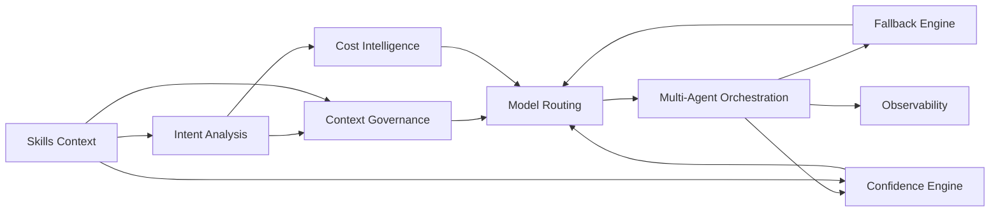

# Bounded Contexts - Sentinela AI Control Plane

## 1. Context Map Overview
Sentinela uses Domain-Driven Design to separate runtime governance concerns into bounded contexts with explicit contracts.

## 2. Bounded Context Definitions

### BC-01 Intent Analysis
- Purpose: classify objective, type, complexity, and RAG need.
- Aggregates: IntentProfile, ComplexityScore.
- Events: IntentAssessed.
- Upstream: Request Intake.
- Downstream: Context Governance, Cost Intelligence, Model Routing.

### BC-02 Context Governance
- Purpose: curate and compress context to maximize signal-to-token ratio.
- Aggregates: ContextBundle, ContextLineage.
- Events: ContextPrepared, ContextCompressed.
- Upstream: Intent Analysis, Knowledge Connectors.
- Downstream: Model Routing, Orchestration.

### BC-03 Cost Intelligence
- Purpose: estimate and govern inference cost and ROI.
- Aggregates: CostEstimate, BudgetEnvelope.
- Events: CostEstimated, BudgetViolationDetected.
- Upstream: Intent Analysis, Pricing Catalog.
- Downstream: Model Routing, Governance APIs.

### BC-04 Model Routing
- Purpose: choose model, provider, and runtime params.
- Aggregates: RoutingDecision, RoutingPolicy.
- Events: ModelRouted, RoutingEscalated.
- Upstream: Intent, Context, Cost, Confidence feedback.
- Downstream: Orchestration runtime.

### BC-05 Multi-Agent Orchestration
- Purpose: compose and execute agent workflows.
- Aggregates: AgentPlan, AgentStepExecution.
- Events: AgentPlanCommitted, AgentStepCompleted.
- Upstream: Model Routing.
- Downstream: Confidence, Fallback, Observability.

### BC-06 Fallback Intelligence
- Purpose: recover from runtime/provider/model failures.
- Aggregates: FallbackPlan, FailureSignal.
- Events: FallbackTriggered, FallbackResolved.
- Upstream: Orchestration runtime signals.
- Downstream: Model Routing, Incident Ops.

### BC-07 Confidence Engine
- Purpose: score confidence, trigger second opinion/escalation.
- Aggregates: ConfidenceAssessment, CalibrationProfile.
- Events: ConfidenceScored, EscalationRequested.
- Upstream: Orchestration outputs and evaluators.
- Downstream: Model Routing, Human Review Queue.

### BC-08 Observability
- Purpose: record metrics, traces, logs, quality outcomes.
- Aggregates: ExecutionTrace, QualityObservation.
- Events: TelemetryRecorded, HallucinationDetected.
- Upstream: All contexts.
- Downstream: Dashboards, Alerting, FinOps.

### BC-09 Skills
- Purpose: manage core/meta skill lifecycle and governance.
- Aggregates: SkillVersion, SkillBenchmarkResult.
- Events: SkillVersionPromoted, SkillVersionRetired.
- Upstream: Evaluation Harness.
- Downstream: Intent/Context/Confidence/Agent systems.

## 3. Ubiquitous Language
- Route Class: Local, Premium, Hybrid.
- Confidence Gate: threshold control that can force second opinion.
- Cost Envelope: approved min/max expected spend per execution.
- Quality Floor: minimum acceptable quality score for task class.
- Escalation Path: deterministic path to higher capability runtime.

## 4. Anti-Corruption Layers
- Provider ACL: normalizes APIs for OpenAI/Anthropic/Gemini/local runtimes.
- Retrieval ACL: normalizes vector/search stores and evidence schemas.
- Telemetry ACL: standard schema before sink-specific adapters.
